# Entity Relationship Diagram

## Speed Dating Application Database Schema

```mermaid
erDiagram
    User {
        uuid id PK
        string email UK
        string hashed_password
        boolean is_active
        boolean is_superuser  
        boolean is_verified
        string first_name
        string last_name
        string display_name
        boolean is_organizer
        datetime created_at
        datetime updated_at
        datetime last_login
        string profile_picture_url
        string bio
    }
    
    OAuthAccount {
        uuid id PK
        uuid user_id FK
        string oauth_name
        string access_token
        string refresh_token
        string account_id
        string account_email
        string account_name
        string account_picture
        datetime created_at
        datetime updated_at
        datetime last_used
    }
    
    Event {
        uuid id PK
        string name
        text description
        string location
        datetime event_date
        datetime registration_deadline
        integer round_duration_minutes
        integer break_duration_minutes
        integer total_rounds
        integer max_attendees
        integer min_attendees
        enum status
        boolean is_published
        boolean registration_open
        boolean qr_enabled
        string qr_secret_key
        integer ticket_price
        string currency
        datetime created_at
        datetime updated_at
        uuid organizer_id FK
    }
    
    Attendee {
        uuid id PK
        string display_name
        integer age
        text bio
        enum category
        boolean checked_in
        datetime check_in_time
        integer table_number
        string qr_token UK
        datetime qr_generated_at
        datetime qr_last_used
        string contact_email
        string contact_phone
        boolean registration_confirmed
        boolean payment_confirmed
        string dietary_requirements
        text special_notes
        datetime registered_at
        datetime updated_at
        uuid user_id FK
        uuid event_id FK
    }
    
    AttendeePreference {
        uuid attendee_id PK,FK
        enum preferred_category PK
        integer preference_strength
        datetime created_at
    }
    
    Round {
        uuid id PK
        integer round_number
        string name
        datetime scheduled_start
        datetime scheduled_end
        datetime actual_start
        datetime actual_end
        integer duration_minutes
        integer break_after_minutes
        enum status
        boolean is_break_active
        boolean auto_advance
        string announcements
        string notes
        datetime created_at
        datetime updated_at
        uuid event_id FK
    }
    
    Match {
        uuid id PK
        integer table_number
        enum attendee1_response
        enum attendee2_response
        datetime attendee1_response_time
        datetime attendee2_response_time
        boolean is_completed
        datetime completed_at
        text attendee1_notes
        text attendee2_notes
        integer attendee1_rating
        integer attendee2_rating
        boolean contact_exchanged
        text admin_notes
        boolean is_flagged
        string flag_reason
        datetime created_at
        datetime updated_at
        uuid event_id FK
        uuid round_id FK
        uuid attendee1_id FK
        uuid attendee2_id FK
    }
    
    QRLogin {
        uuid id PK
        string token UK
        string token_hash
        datetime expires_at
        boolean is_active
        datetime used_at
        integer usage_count
        integer max_uses
        string ip_address
        string user_agent
        string generated_by_ip
        string qr_code_url
        boolean access_granted
        boolean is_revoked
        datetime revoked_at
        string revoked_reason
        string session_id
        string device_fingerprint
        datetime created_at
        datetime updated_at
        uuid user_id FK
        uuid event_id FK
        uuid attendee_id FK
    }

    %% Relationships
    User ||--o{ OAuthAccount : "has multiple OAuth accounts"
    User ||--o{ Event : "organizes events"
    User ||--o{ Attendee : "attends events"
    User ||--o{ QRLogin : "has QR tokens"
    
    Event ||--o{ Attendee : "has attendees"
    Event ||--o{ Round : "has rounds"
    Event ||--o{ Match : "has matches"
    Event ||--o{ QRLogin : "generates QR tokens"
    
    Attendee ||--o{ AttendeePreference : "has preferences"
    Attendee ||--o{ Match : "participates as attendee1"
    Attendee ||--o{ Match : "participates as attendee2"
    
    Round ||--o{ Match : "contains matches"
```



## Key Relationships

### Authentication Flow
```
User ←→ OAuthAccount (1:∞)
├── Google OAuth
├── Facebook OAuth
└── Future providers
```

### Event Management Flow
```
User [Organizer] ←→ Event (1:∞)
├── Event Configuration
├── Attendee Management  
├── Round Scheduling
└── Match Coordination
```

### Attendee Registration Flow
```
User ←→ Attendee ←→ Event (∞:∞)
├── Category Selection
├── Preference Definition
├── QR Token Generation
└── Check-in Process
```

### Matching System Flow
```
Event → Round → Match
├── Attendee Pairing
├── Response Collection
├── Mutual Match Detection
└── Results Aggregation
```

### QR Authentication Flow
```
Attendee → QRLogin ← Event
├── Token Generation
├── Security Validation
├── Usage Tracking
└── Access Control
```

## Enums and Constants

### EventStatus
- `DRAFT` - Event being planned
- `REGISTRATION_OPEN` - Accepting registrations  
- `REGISTRATION_CLOSED` - Registration ended
- `ACTIVE` - Event in progress
- `COMPLETED` - Event finished
- `CANCELLED` - Event cancelled

### AttendeeCategory
- `TOP_MALE` - Top male category
- `TOP_FEMALE` - Top female category
- `BOTTOM_MALE` - Bottom male category  
- `BOTTOM_FEMALE` - Bottom female category

### RoundStatus
- `PENDING` - Waiting to start
- `ACTIVE` - Currently running
- `BREAK` - Break period
- `COMPLETED` - Round finished
- `CANCELLED` - Round cancelled

### MatchResponse  
- `YES` - Interested in further contact
- `NO` - Not interested
- `MAYBE` - Uncertain/conditional interest
- `NO_RESPONSE` - No response provided

## Database Constraints

### Primary Keys
- All tables use UUID primary keys for security and scalability

### Unique Constraints
- `User.email` - Prevents duplicate accounts
- `Attendee.qr_token` - Ensures unique QR access
- `QRLogin.token` - Prevents token collisions
- `OAuthAccount(oauth_name, account_id)` - Prevents duplicate OAuth links

### Foreign Key Constraints
- All relationships enforce referential integrity
- Cascade deletes preserve data consistency
- Nullable foreign keys support optional relationships

### Check Constraints
- `Event.max_attendees >= min_attendees`
- `Round.duration_minutes > 0`
- `Match.attendee1_id != attendee2_id`
- `QRLogin.expires_at > created_at`

## Indexes for Performance

### Primary Indexes
- All primary keys automatically indexed
- Foreign keys automatically indexed

### Composite Indexes
- `Attendee(user_id, event_id)` - Registration lookups
- `Match(event_id, round_id, table_number)` - Round management
- `QRLogin(event_id, attendee_id)` - QR token validation

### Query Optimization Indexes
- `Event.status` - Event filtering
- `Attendee.category` - Matching queries  
- `Match.is_completed` - Progress tracking
- `QRLogin.expires_at` - Token cleanup

This ER diagram represents a comprehensive database design that supports all aspects of the Speed Dating Application while maintaining data integrity, security, and performance.